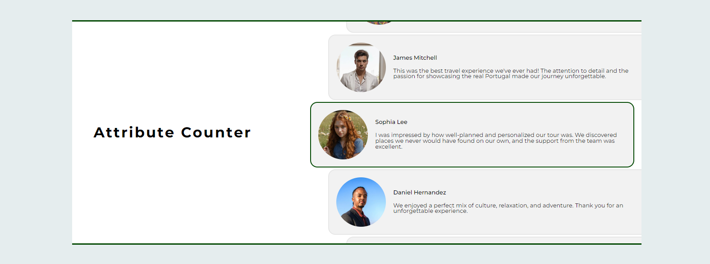

# AERO Create Test

_automatic-swiper_ this is two automatic swipers in React, one implemented on changing the attribute of elements, the other on moving an element in the DOM tree.

## 📦 Technologies
- `Java Script`
- `React`

## 🏃‍♂️ Running the Project
1. Clone the repository to your local machine.
2. Run `npm install` or `yarn` in the project directory to install the required dependencies.
3. Run `npm run dev` or `yarn dev` to get the project started.

## 😍 Preview

